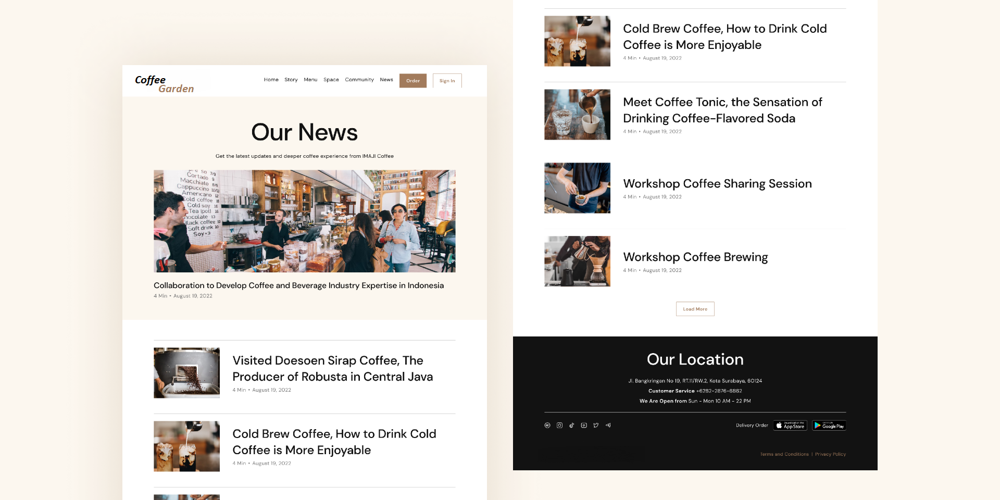
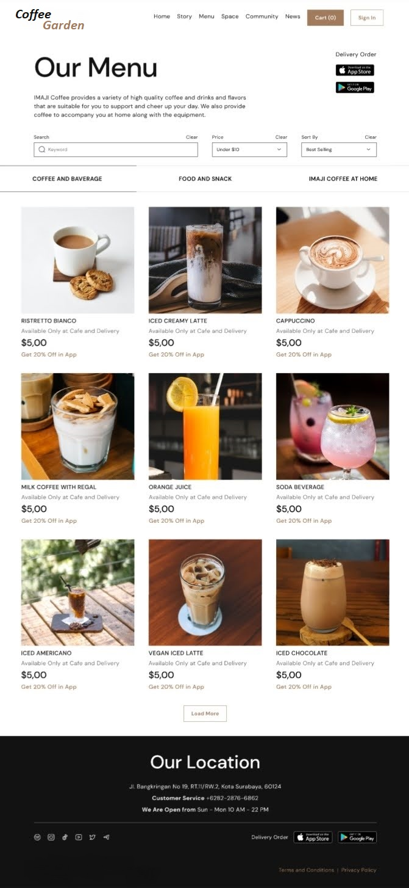

## Coffe Garden


#### Coffee Garden project I made with Django Rest Framework

## Description

<div class="container" style="display:flex; align-items: center;">
    <div class="text" style="flex: 1;
    margin-right: 20px;">
        <p>This project is a website created for selling coffee.
        Customers can view various coffee varieties,
        add them to their carts, place orders,
        and leave ratings and comments. Additionally,
        they can read our latest news from our special news section.
        They can also learn about the events that have occurred and will occur in the shop.</p>
    </div>
    
</div>


## Installation
````bash
git clone https://github.com/elizamin-orucov/coffee_garden_project .
pip install -r requirements.txt
django-admin startproject core .
py manage.py migrate
py manage.py createsuperuser
py manage.py runserver
````