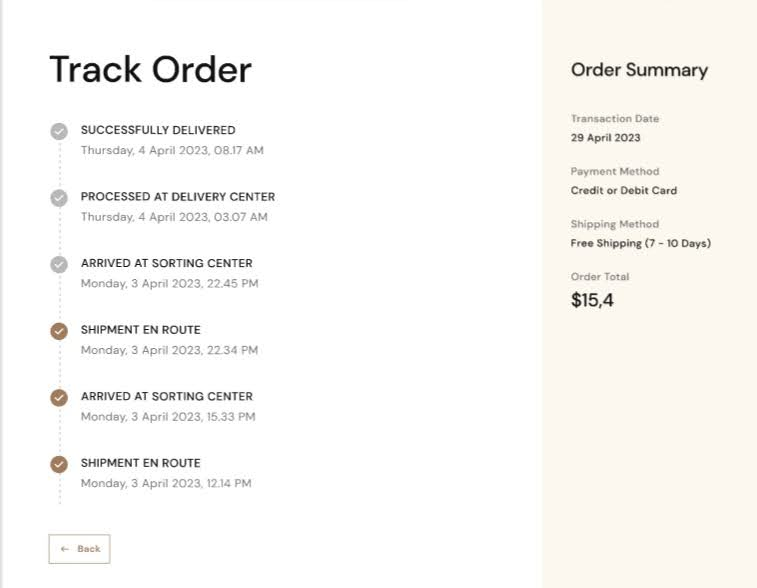

## &nbsp;&nbsp;&nbsp;&nbsp;&nbsp;&nbsp;&nbsp;&nbsp;&nbsp;&nbsp;&nbsp;&nbsp;&nbsp;&nbsp;&nbsp;&nbsp;Coffee Garden project I made with Django Rest Framework
&nbsp;&nbsp;&nbsp;&nbsp;&nbsp;&nbsp;&nbsp;&nbsp;&nbsp;&nbsp;&nbsp;&nbsp;&nbsp;&nbsp;&nbsp;&nbsp;&nbsp;&nbsp;&nbsp;&nbsp;&nbsp;&nbsp;&nbsp;&nbsp;&nbsp;&nbsp;&nbsp;&nbsp;&nbsp;&nbsp;&nbsp;&nbsp;&nbsp;&nbsp;&nbsp;&nbsp;&nbsp;&nbsp;

### Coffee Garden


| Description                                                                                                                                                                                                                                                                                                | Images                                                                                                                                                                          |
|------------------------------------------------------------------------------------------------------------------------------------------------------------------------------------------------------------------------------------------------------------------------------------------------------------|---------------------------------------------------------------------------------------------------------------------------------------------------------------------------------|
| This project is a website designed for coffee sales. Customers can browse various types of coffee, add them to their carts, place orders, leave ratings and reviews. They can track their orders from the order tracking section. Additionally, they can read our latest news from our custom news section |   


## Installation
````bash
git clone https://github.com/elizamin-orucov/coffee_garden_project .
pip install -r requirements.txt
django-admin startproject core .
py manage.py migrate
py manage.py createsuperuser
py manage.py runserver
````
